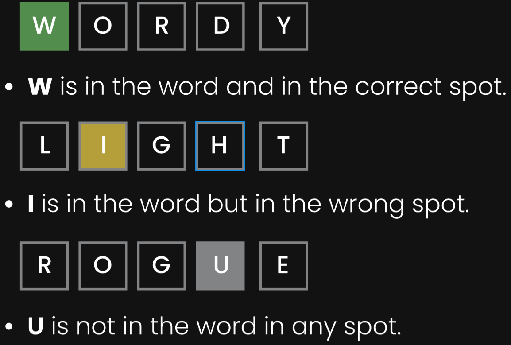
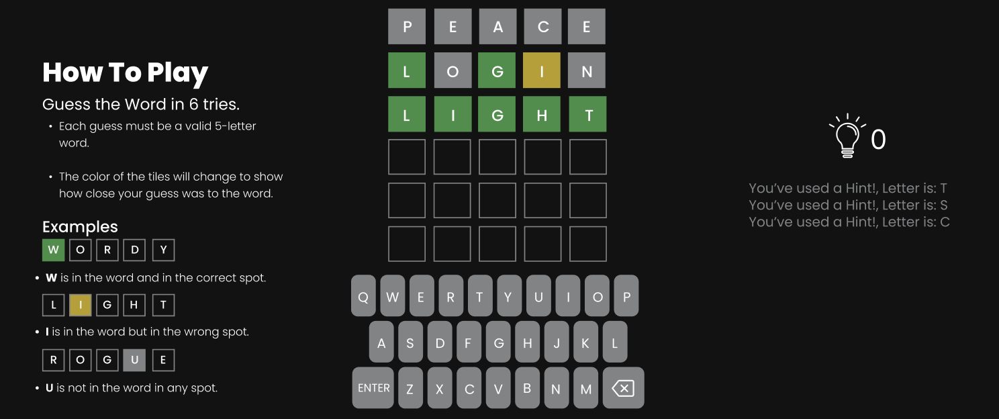

# ***Lexi (A Wordle Game)***
## Date: 9/11/2025
### By: Hasan Al Dhaif
[Website](http://www.google.com) | [GitHub](https://github.com/izZERO) | [Linkedln](https://www.linkedin.com/in/hasan-aldhaif/)

***
# ***Description***
Wordle Clone , A simple word guessing game where players have six attempts to guess a hidden five-letter word, with feedback given for correct letters and positions.

***
# ***technologies Used***
1. HTML5 (Hyper Text Markup Language 5)
2. CSS (Cascading Style Sheets)
3. JS (Vanilla JavaScript)

***
# ***Getting Started***

## How to Play?
### Guess the Word in 6 tries.
* Each guess must be a valid 5-letter word.

* The color of the tiles will change to show how close your guess was to the word.

### Examples

# ***Figma Design***
* [Figma Design Link](https://www.figma.com/design/BLooE0P8JRU96lSwSwk0Ha/Untitled?node-id=0-1&t=kq2Y0WMfsb9eAgxH-1)

# ***Screenshots***
### Image Header 1

### Image Header 2

- [ ] Future Update 1
- [ ] Future Update 2
- [x] Completed Update
- [x] ~~Strikethrough~~ Items Also

# ***Credits***

Funny Images: [Google]()
Markdown Guide: [ia.net]()
Markdown Cheatsheet: [GitHub]()
