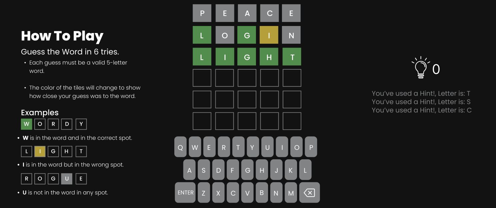
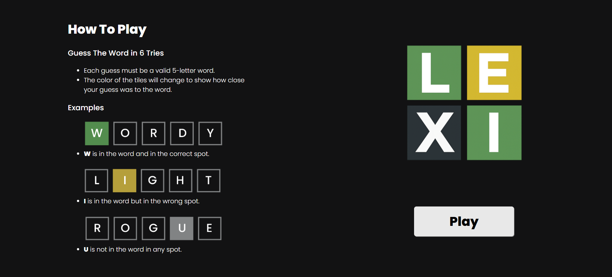
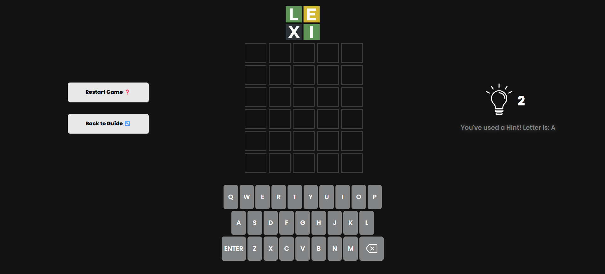

# ***Lexi (A Wordle Game)***
## Date: 9/11/2025
### By: Hasan Al Dhaif
[GitHub](https://github.com/izZERO) | [Linkedln](https://www.linkedin.com/in/hasan-aldhaif/)

***
# ***Live Demo***
* [Play it Here!](https://lexi-js.surge.sh/)

***
# ***Description***
Wordle Clone , A simple word guessing game where players have six attempts to guess a hidden five-letter word, with feedback given for correct letters and positions.

***
# ***technologies Used***
1. HTML5 (Hyper Text Markup Language 5)
2. CSS (Cascading Style Sheets)
3. JS (Vanilla JavaScript)

***
# ***Getting Started***

## How to Play?
### Guess the Word in 6 tries.
* Each guess must be a valid 5-letter word.

* The color of the tiles will change to show how close your guess was to the word.

### Examples

* **W** is in the word and in the correct spot.

* **I** is in the word but in the wrong spot.

* **U** is not in the word in any spot.

# ***Figma Design***
* [Figma Design Link](https://www.figma.com/design/BLooE0P8JRU96lSwSwk0Ha/Untitled?node-id=0-1&t=kq2Y0WMfsb9eAgxH-1)

# ***Screenshots***
### Landing Page

### Game Page

# ***Future Work***
- [ ] Hard Mode
- [ ] Timer Mode
- [ ] Toggle Theme (Dark / Light) Modes

# ***Credits***

Original Game Creators: [Wordle](https://www.nytimes.com/games/wordle/index.html)

